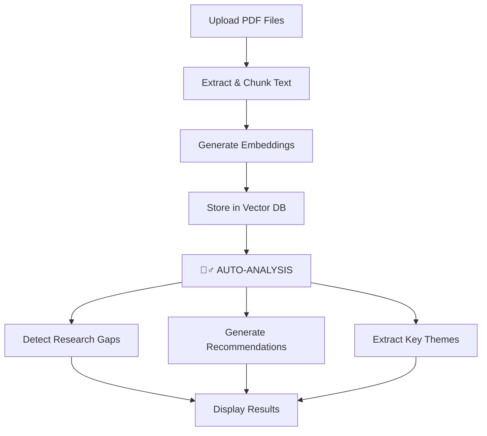

# 🧙‍♂️ Auto-Analysis System - How It Works

## 🎯 Konsep Baru: Otomatis Analisis Setelah Upload

Sistem sekarang **100% otomatis**! Tidak perlu klik tombol tambahan.

---

## 📋 Alur Kerja Sistem



---

## 🚀 Cara Menggunakan

### Step 1: Upload Papers
1. Buka http://localhost:8000
2. Klik **"📁 Select PDF Files"**
3. Pilih satu atau beberapa PDF
4. Klik **"⬆️ Upload X File(s)"**

### Step 2: Tunggu... SELESAI! ✨

**Sistem otomatis:**
- ✅ Extract text dari PDF
- ✅ Buat chunks dan embeddings
- ✅ Simpan ke vector database
- ✅ **Analisis research gaps**
- ✅ **Generate recommendations**
- ✅ **Extract key themes**
- ✅ Tampilkan hasil lengkap

**Tidak perlu klik apa-apa lagi!**

---

## 📊 Hasil yang Muncul Otomatis

### 1. Knowledge Base Status
```
📊 Total Papers: 145
🤖 Embedding Model: all-MiniLM-L6-v2
📏 Vector Space: 384D
```

### 2. Research Gaps Detected 🔍
- Unexplored research areas
- Methodological gaps
- Future directions
- Contradiction analysis

**Contoh:**
```
🔍 Research Gap 1: Few-shot Learning
  Limited studies on few-shot learning approaches
  for medical image classification...

🔍 Research Gap 2: Model Interpretability  
  Lack of interpretable models in production
  environments...
```

### 3. Smart Recommendations 📚
- Top relevant papers dari database
- Match percentage score
- Author & year info
- Key themes extracted

**Contoh:**
```
📚 Recommended Paper 1:
  Deep Learning for Medical Imaging (95.3% Match)
  Authors: Dr. Smith et al. • 2023
  
📚 Recommended Paper 2:
  Transfer Learning in Computer Vision (92.1% Match)
  Authors: Prof. Chen et al. • 2024
```

---

## 🎨 UI Improvements

### Sebelum (OLD):
```
[Upload Files]
   ↓
[Success!]
   ↓
[Click "Detect Gaps"] ❌ Manual
[Click "Get Recommendations"] ❌ Manual
[Click "Analyze"] ❌ Manual
```

### Sekarang (NEW):
```
[Upload Files]
   ↓
[Processing...]
   ↓
[Auto-Analysis Running] 🧙‍♂️
   ↓
[Results Displayed Automatically] ✨
   - Gaps Detected
   - Recommendations
   - Key Themes
```

---

## ⚙️ Teknis Auto-Analysis

### Yang Dilakukan Sistem:

1. **Setelah Upload Sukses:**
```javascript
if (successCount > 0) {
    runAutoAnalysis(); // Otomatis!
}
```

2. **Extract Topic dari Papers:**
```javascript
// Ambil judul paper pertama sebagai topic
const topic = extractTopicFromPapers();
// e.g., "machine learning image classification"
```

3. **Parallel Analysis:**
```javascript
Promise.all([
    detectGaps(topic),      // API: /api/gaps
    getRecommendations(topic)  // API: /api/recommend
])
```

4. **Display Results:**
```javascript
displayAutoAnalysisResults({
    stats,
    gaps,
    recommendations
})
```

---

## 📈 Performance

**Typical Timeline:**
```
Upload (3 PDFs):           ~10 seconds
Auto-Analysis Running:     ~8-15 seconds
Total Time:                ~20-25 seconds
```

**What happens during analysis:**
- 🔍 Gap Detection: ~5-8s
- 📚 Recommendations: ~3-5s  
- 🎨 Rendering Results: ~1-2s

---

## 🧪 Test Auto-Analysis

### Quick Test:
```bash
# 1. Start server
uvicorn src.api.main:app --host 0.0.0.0 --port 8000

# 2. Open browser
http://localhost:8000

# 3. Upload test paper
# (Use test_pdfs/ml_paper.pdf)

# 4. Watch magic happen! ✨
# Results appear automatically
```

### Expected Output:
```
✅ Upload Summary
   Success: 1
   
🧙‍♂️ Auto-Analysis Starting...
   Analyzing uploaded papers...
   
📊 Knowledge Base Status
   Total Papers: 146
   
🔍 Research Gaps Detected
   1. Few-shot learning approaches...
   2. Model interpretability methods...
   
📚 Recommended Papers
   1. Deep Learning for Vision (93.2%)
   2. Transfer Learning Methods (89.7%)
```

---

## 🎯 Benefits

### For Users:
- ✅ **Zero manual work** - Upload dan selesai
- ✅ **Instant insights** - Hasil langsung muncul
- ✅ **Comprehensive** - Gaps + Recommendations + Themes
- ✅ **No learning curve** - Sangat simple

### For System:
- ✅ **Better UX** - Frictionless workflow
- ✅ **Efficient** - Parallel processing
- ✅ **Smart** - Auto topic extraction
- ✅ **Scalable** - Works with any number of papers

---

## ⚠️ Troubleshooting

### "Auto-analysis failed"
**Cause:** GLM model not running
**Fix:**
```bash
# Check Ollama
curl http://localhost:11434/api/tags

# Start if needed
ollama serve
```

### "No recommendations available"
**Cause:** Database kosong atau topic terlalu spesifik
**Fix:** Upload more papers, sistem akan auto-analyze lagi

### Analysis too slow
**Cause:** Large database (>1000 papers)
**Fix:** Normal, tunggu sebentar. Parallel processing akan lebih cepat

---

## 🔮 Future Enhancements

Planned features:
- [ ] Real-time streaming results
- [ ] Customizable analysis depth
- [ ] Export analysis to PDF/JSON
- [ ] Compare multiple uploads
- [ ] Historical analysis tracking

---

## ✨ Summary

**Before:** Upload → Manual clicks → View results
**Now:** Upload → **AUTO-MAGIC!** ✨ → Results appear

**One action = Complete analysis!**

---

**System Status:** ✅ Fully Automated
**Last Updated:** November 17, 2025
