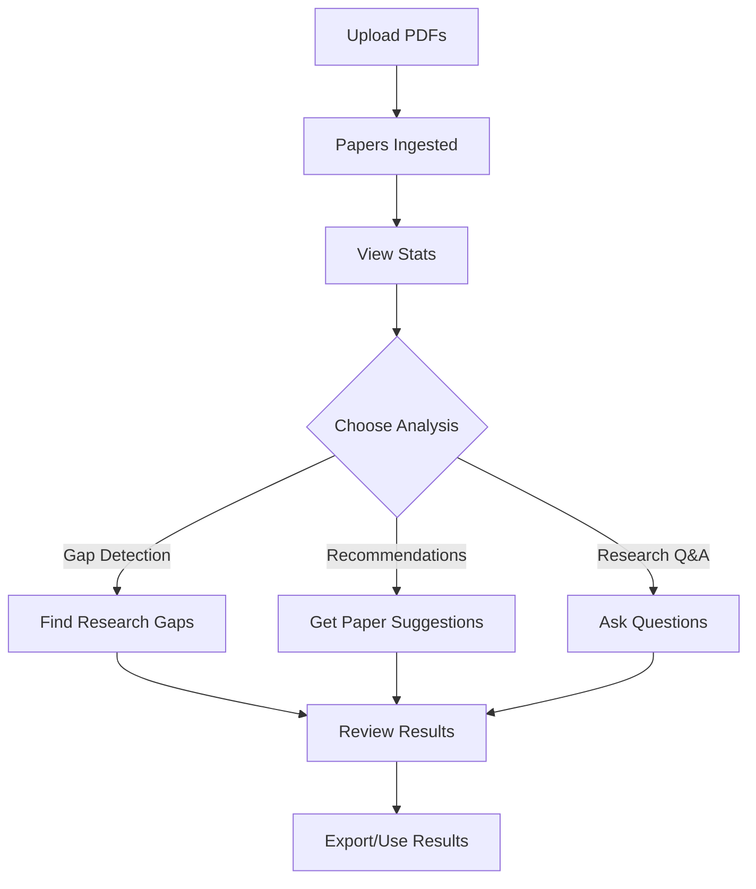

# 🧙‍♂️ Main Analysis Features - User Guide

## Overview

After uploading papers, you can run the **main analysis features** of the Wizard Research system:

1. **🔍 Gap Detection** - Identify research gaps
2. **📚 Smart Recommendations** - Get personalized paper recommendations  
3. **🔬 Research Analysis** - Comprehensive topic analysis with AI

---

## 🎯 How to Use Main Features

### Step 1: Upload Papers First

Before running analysis, ensure you have papers in the database:

```bash
# Check database status
curl http://localhost:8000/api/stats

# Should show: "total_documents": > 0
```

Or click **"📊 View Database Stats"** button after upload.

---

### Step 2: Run Analysis

Open http://localhost:8000 and scroll to **"🧙‍♂️ Research Analysis & Recommendations"** section.

#### 🔍 **Gap Detection**

1. Click **"🚀 Detect Research Gaps"** button
2. Enter research topic (e.g., "machine learning")
3. Wait for analysis
4. View detected gaps with importance scores

**What it does:**
- Analyzes your uploaded papers
- Identifies unexplored areas
- Finds methodological gaps
- Suggests future directions

**API:**
```bash
curl -X POST http://localhost:8000/api/gaps \
  -H "Content-Type: application/json" \
  -d '{"topic": "deep learning", "depth": "standard"}'
```

---

#### 📚 **Smart Recommendations**

1. Click **"🎯 Get Recommendations"** button
2. Describe your research interest
3. System searches knowledge base
4. Get top 10 relevant papers

**What it does:**
- Semantic search in your database
- Ranks papers by relevance
- Shows citation counts
- Provides direct links

**API:**
```bash
curl -X POST http://localhost:8000/api/recommend \
  -H "Content-Type: application/json" \
  -d '{"query": "transformer models", "max_results": 10, "strategy": "hybrid"}'
```

**Response includes:**
- Recommended papers with scores
- Research themes
- Key papers
- Identified gaps

---

#### 🔬 **Research Analysis**

1. Click **"🔬 Analyze Research"** button
2. Ask a research question
3. AI analyzes and responds
4. Get comprehensive answer

**What it does:**
- RAG-powered Q&A
- Retrieves relevant papers
- Generates contextual answers
- Uses GLM-4 for analysis

**API:**
```bash
curl -X POST http://localhost:8000/api/chat \
  -H "Content-Type: application/json" \
  -d '{"message": "What are the latest trends in NLP?", "use_history": true}'
```

---

## 📊 Complete Workflow



### Full Example:

```bash
# 1. Upload papers
curl -X POST -F "file=@paper1.pdf" http://localhost:8000/api/ingest
curl -X POST -F "file=@paper2.pdf" http://localhost:8000/api/ingest

# 2. Check stats
curl http://localhost:8000/api/stats

# 3. Detect gaps
curl -X POST http://localhost:8000/api/gaps \
  -H "Content-Type: application/json" \
  -d '{"topic": "neural networks"}'

# 4. Get recommendations
curl -X POST http://localhost:8000/api/recommend \
  -H "Content-Type: application/json" \
  -d '{"query": "attention mechanisms", "max_results": 5}'

# 5. Ask question
curl -X POST http://localhost:8000/api/chat \
  -H "Content-Type: application/json" \
  -d '{"message": "Explain transformers in simple terms"}'
```

---

## 🎨 UI Features

### Analysis Results Section

After running any analysis, results appear in the **"Analysis Results"** section with:

- **Beautiful formatting** - Color-coded cards
- **Structured data** - Clear sections and headers
- **Actionable insights** - Importance scores, links
- **Export-ready** - Copy/paste friendly

### Button States

- **Loading**: Shows spinner + status message
- **Success**: Displays formatted results
- **Error**: Clear error message with details

---

## 🔧 Advanced Usage

### Custom Analysis Depth

```javascript
// In browser console
fetch('/api/gaps', {
    method: 'POST',
    headers: {'Content-Type': 'application/json'},
    body: JSON.stringify({
        topic: 'quantum computing',
        depth: 'deep' // Options: 'quick', 'standard', 'deep'
    })
})
```

### Recommendation Strategies

```javascript
fetch('/api/recommend', {
    method: 'POST',
    headers: {'Content-Type': 'application/json'},
    body: JSON.stringify({
        query: 'medical AI',
        max_results: 20,
        strategy: 'diversity' // Options: 'relevance', 'diversity', 'hybrid'
    })
})
```

---

## 📈 Performance

**Typical response times:**
- Gap Detection: 5-15 seconds
- Recommendations: 2-5 seconds
- Research Analysis: 3-10 seconds

**Factors affecting speed:**
- Database size (more papers = longer)
- Query complexity
- GLM model response time
- Network latency

---

## ❓ Troubleshooting

### "No recommendations found"
- **Cause**: Database empty or query too specific
- **Fix**: Upload more papers, broaden query

### "Analysis failed"
- **Cause**: GLM server down
- **Fix**: Check `curl http://localhost:11434/api/tags`
- Start Ollama: `ollama serve`

### Slow responses
- **Cause**: Large database (>1000 papers)
- **Fix**: Reduce `max_results`, optimize query

### Empty gaps detected
- **Cause**: Insufficient papers on topic
- **Fix**: Upload domain-specific papers

---

## 🎯 Best Practices

1. **Upload domain-specific papers** for better analysis
2. **Use specific queries** for targeted recommendations
3. **Start with standard depth** for gap detection
4. **Review multiple analyses** before drawing conclusions
5. **Export results** for reference

---

## 🚀 Quick Test

```bash
# After uploading papers, test all features:

# 1. Gap Detection
curl -X POST http://localhost:8000/api/gaps \
  -H "Content-Type: application/json" \
  -d '{"topic": "AI ethics"}'

# 2. Recommendations  
curl -X POST http://localhost:8000/api/recommend \
  -H "Content-Type: application/json" \
  -d '{"query": "fairness in ML", "max_results": 5}'

# 3. Research Chat
curl -X POST http://localhost:8000/api/chat \
  -H "Content-Type: application/json" \
  -d '{"message": "Summarize key AI ethics concerns"}'
```

---

## ✅ Summary

| Feature | Button | API Endpoint | Purpose |
|---------|--------|--------------|---------|
| Gap Detection | 🚀 Detect Research Gaps | `/api/gaps` | Find unexplored areas |
| Recommendations | 🎯 Get Recommendations | `/api/recommend` | Suggest relevant papers |
| Research Analysis | 🔬 Analyze Research | `/api/chat` | Answer research questions |

**All features require:**
- ✅ Server running
- ✅ Papers uploaded
- ✅ GLM model available

---

**Last Updated:** November 17, 2025
**Current Status:** ✅ All features operational
