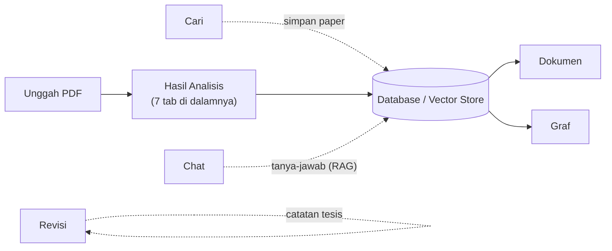

# Penjelasan Hasil per Tab & Menu — Research Wizard

Dokumen ini menjelaskan **apa yang ditampilkan di setiap menu dan setiap tab** pada
aplikasi Research Wizard, dari mana datanya berasal, dan bagaimana cara membacanya.
Tujuannya agar Anda (dan penguji) memahami hasil penelitian yang muncul di tiap layar.

> Ringkasan singkat: inti "hasil penelitian" ada di halaman **Hasil Analisis**
> (muncul otomatis setelah Anda mengunggah PDF). Halaman itu punya **7 tab**.
> Menu-menu lain di bar atas (Navbar) adalah fitur pendukung.

---

## Alur Besar Aplikasi

| Tahap | Menu | Keterangan |
|-------|------|-----------|
| 1 | **Unggah** | Titik masuk utama: unggah paper untuk dianalisis. |
| 2 | **Hasil Analisis** | Output AI tampil di sini (7 tab). |
| 3 | **Dokumen / Graf / Chat** | Menelusuri & memanfaatkan paper yang sudah tersimpan. |
| — | **Cari / Revisi** | Pencarian paper eksternal & dokumentasi revisi tesis. |

---

# Bagian A — Menu Utama (Navbar)

Enam menu di bar atas. Berikut hasil/isi tiap menu.

## A.1 Unggah (`/`)
- **Fungsi:** Mengunggah satu atau beberapa PDF paper untuk dianalisis otomatis.
- **Yang ditampilkan:**
  - Area tarik-letakkan (drag & drop) PDF.
  - Panduan "Cara kerja — 3 langkah" (Unggah → AI Menganalisis → Lihat Hasil).
  - Statistik: jumlah Paper Terindeks, Chunk di Vector DB, perkiraan waktu analisis.
- **Hasil akhir:** Setelah klik *Analisis*, halaman otomatis berpindah ke
  **Hasil Analisis** (lihat Bagian B).

## A.2 Cari (`/search`)
- **Fungsi:** Mencari paper dari database **eksternal**, bukan dari koleksi Anda.
- **Sumber data:** arXiv, Semantic Scholar, CORE, CrossRef, PubMed, Europe PMC.
- **Yang ditampilkan:** Daftar paper hasil pencarian — judul, penulis, tahun,
  abstrak, dan tautan ke sumber. Bisa difilter berdasarkan sumber dan rentang tahun.
- **Manfaat:** Menambah bahan literatur sebelum dianalisis.

## A.3 Chat (`/chat`)
- **Fungsi:** Tanya-jawab dengan AI tentang paper yang sudah tersimpan
  (berbasis **RAG** — Retrieval-Augmented Generation).
- **Yang ditampilkan:** Percakapan, jawaban AI, dan **daftar sumber** (paper yang
  dijadikan rujukan jawaban).
- **Manfaat:** Menggali isi korpus tanpa membaca ulang seluruh paper.

## A.4 Dokumen (`/documents`)
- **Fungsi:** Mengelola seluruh paper yang tersimpan di database.
- **Yang ditampilkan:** Statistik (Total Dokumen, Total Chunk, Vector Store),
  pencarian isi dokumen, dan tombol hapus per dokumen.
- **Manfaat:** Memastikan koleksi paper yang akan dianalisis sudah benar.

## A.5 Graf (`/graph`)
- **Fungsi:** Peta visual jaringan konsep dari **seluruh** paper, gaya VOSviewer.
- **Yang ditampilkan:** Graf interaktif — titik = konsep (metode/model/temuan),
  garis = hubungan, ukuran titik = jumlah koneksi, warna = klaster topik.
  Disertai statistik (node, relasi, fakta, cluster) dan filter `min degree`.
- **Cara membaca:** Klik titik untuk fokus ke konsep dan tetangganya.

## A.6 Revisi (`/revisi`)
- **Fungsi:** Dokumentasi revisi proposal tesis (bukan hasil analisis AI).
- **Yang ditampilkan:** Daftar komentar penguji beserta kategori, tingkat
  keparahan, dan **aksi perbaikan** yang sudah dilakukan (judul, penjelasan, lokasi
  di bab tesis).

---

# Bagian B — Halaman "Hasil Analisis" (7 Tab)

Halaman ini (`/results/<id>`) adalah **inti hasil penelitian**. Di bagian atas ada
**baris statistik**, lalu **7 tab**.

### Baris Statistik (selalu tampil di atas tab)
| Statistik | Arti |
|-----------|------|
| File Diproses | Jumlah PDF yang dianalisis |
| Chunk Dianalisis | Potongan teks yang diproses |
| Topik Ditemukan | Jumlah topik hasil ekstraksi |
| Gap Terdeteksi | Jumlah celah penelitian |
| Entitas KG | Jumlah simpul Knowledge Graph |
| Fakta SPO | Jumlah fakta Subject–Predicate–Object |

## B.1 Ringkasan (Overview)
- **Apa yang ditampilkan:** Gambaran umum hasil — ringkasan naratif paper,
  kotak "Arah Penelitian" (3 rekomendasi teratas), serta kartu Topik Utama dan
  Gap Penelitian.
- **Gunakan untuk:** Titik awal membaca hasil. Tombol pintasan mengarah ke tab detail.

## B.2 Topik & Analisis (Topics)
- **Apa yang ditampilkan:** Daftar topik utama yang diekstrak AI dari isi paper
  (kartu bernomor) + ringkasan **analisis komparatif** antar-paper.
- **Sumber:** Ekstraksi otomatis oleh LLM dari teks dokumen.

## B.3 Gap Penelitian (Gaps)
- **Apa yang ditampilkan:** Celah penelitian (synthesis gap) hasil analisis lintas
  paper, dikategorikan dengan **indikator Cooper (1998)**:

  | Jenis | Warna | Arti |
  |-------|-------|------|
  | **Fragmentasi** | Biru | Topik sama dibahas terpisah tanpa integrasi |
  | **Inkonsistensi** | Kuning | Temuan antar-paper saling bertentangan |
  | **Ketidaklengkapan** | Merah | Aspek kritis belum tercakup literatur |

- **Tiap kartu gap memuat:** skor kepercayaan (confidence), verdict rule-engine
  (ACCEPT/REVIEW/REJECT), bukti pendukung, dan arah penelitian yang disarankan.
- **Penting:** Output ini berupa **indikator gap**, bukan kesimpulan final —
  keputusan akhir tetap di tangan peneliti.

## B.4 Rekomendasi (Recommendations)
- **Apa yang ditampilkan:** Arah penelitian yang dapat ditindaklanjuti, diberi
  **prioritas** (Tinggi / Sedang / Rendah).
- **Tiap rekomendasi memuat:** deskripsi, **WHY** (mengapa penting), dan **HOW**
  (cara/pendekatan memulai) — dapat dibuka lewat "Lihat detail".

## B.5 Peta Jalan (Roadmap)
- **Apa yang ditampilkan:** Rencana penelitian bertahap dalam bentuk linimasa:
  **Jangka Pendek → Menengah → Panjang**, masing-masing berisi langkah konkret.

## B.6 Graf Pengetahuan (Knowledge Graph)
- **Apa yang ditampilkan:** Peta visual konsep khusus dari paper yang dianalisis —
  titik = konsep (metode, domain, temuan), garis = hubungan. Disertai statistik
  Nodes, Edges, dan jumlah jenis entitas, lengkap dengan legenda warna.
- **Beda dengan menu Graf:** Tab ini fokus pada paper batch yang baru dianalisis;
  menu **Graf** menampilkan graf gabungan seluruh korpus.

## B.7 Pipeline
- **Apa yang ditampilkan:** Detail teknis proses di balik layar (untuk verifikasi
  kualitas dan keandalan hasil), yaitu:
  - **Mode eksekusi:** `langgraph` (penuh), `sequential` (fallback), atau `llm-only`.
  - **Dasbor angka:** Entitas KG, Fakta SPO, Aturan Lolos, Aturan Ditandai.
  - **Rule Engine Validation:** jumlah Passed / Flagged / Rejected.
  - **Validated Gap Indicators:** indikator gap beserta verdict & confidence.
  - **Reasoning Trace:** jejak penalaran agen **Observe → Think → Act → Evaluate**.
  - **Evaluation Metrics:** Pipeline Score, Topic Coverage, Recommendation
    Completeness, KG Density.

---

## Glosarium Singkat
- **RAG (Retrieval-Augmented Generation):** AI menjawab dengan mengambil potongan
  paper relevan lebih dulu, lalu merangkainya jadi jawaban bersumber.
- **SPO (Subject–Predicate–Object):** bentuk fakta terstruktur, mis.
  *(CNN) — (digunakan untuk) — (klasifikasi citra)*.
- **Knowledge Graph (KG):** jaringan konsep dan hubungannya.
- **Rule Engine:** validator simbolik yang menilai indikator gap
  (ACCEPT / REVIEW / REJECT) agar hasil tidak sekadar mengandalkan LLM.
- **Synthesis Gap (Cooper, 1998):** celah yang muncul dari menyintesis banyak
  paper — fragmentasi, inkonsistensi, atau ketidaklengkapan.
