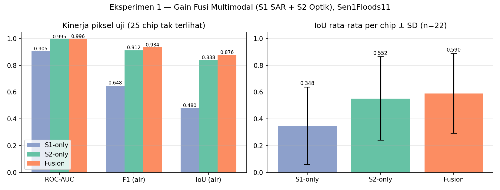
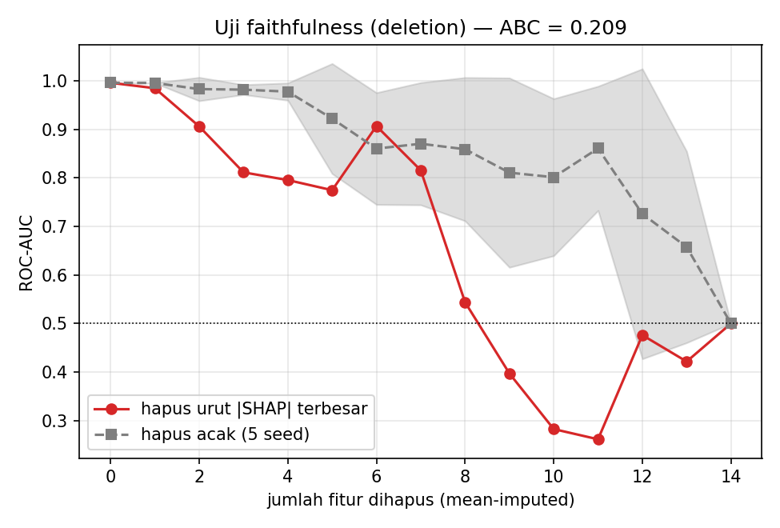
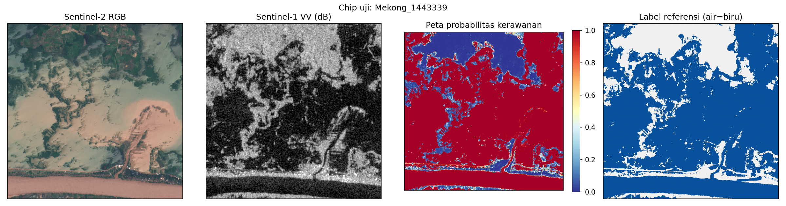

# Hasil Pra-Penelitian

Dua eksperimen nyata dijalankan end-to-end pada subset Sen1Floods11
(60 chip latih + 25 chip uji, split resmi, chip uji tidak pernah dilihat saat
pelatihan). Seluruh angka berasal dari `results/exp1_metrics.json` dan
`results/exp2_metrics.json`.

## Eksperimen 1 — Gain Fusi Multimodal (S1 SAR + S2 Optik)

**Pertanyaan:** apakah fusi Sentinel-1 (SAR) + Sentinel-2 (optik) mengungguli
tiap modality tunggal untuk klasifikasi piksel air banjir?

**Setup:** LightGBM per-piksel; 316.794 piksel latih (stratified per chip),
evaluasi pada **seluruh 5.903.769 piksel valid** dari 25 chip uji (14,75% air).
Fitur: S1 = VV, VH, VV−VH, rerata lokal 5×5 (5 fitur); S2 = B2, B3, B4, B8,
B11, B12 + NDWI, MNDWI, NDVI (9 fitur); Fusi = 14 fitur.

| Model | Fitur | ROC-AUC | F1 (air) | IoU pooled | IoU/chip (n=22) |
|---|---|---|---|---|---|
| S1-only (SAR) | 5 | 0,905 | 0,648 | 0,480 | 0,348 ± 0,288 |
| S2-only (optik) | 9 | 0,995 | 0,912 | 0,838 | 0,552 ± 0,311 |
| **Fusi S1+S2** | **14** | **0,996** | **0,934** | **0,876** | **0,590 ± 0,298** |

**Temuan:**
1. **Fusi menang di semua metrik**: +3,8 poin IoU pooled dan +2,2 poin F1
   di atas modality tunggal terbaik (S2), serta +3,8 poin IoU rata-rata per chip.
2. SAR sendirian jauh lebih lemah (IoU 0,480) — speckle dan kemiripan
   backscatter permukaan halus; namun tetap **komplementer**: informasi SAR
   memperbaiki kesalahan optik (bayangan awan, air keruh).
3. Reduksi galat relatif F1: (1−0,912)→(1−0,934) = **25% galat terpangkas**
   oleh fusi dibanding S2-only.

## Eksperimen 2 — Explainable AI: SHAP + Uji Faithfulness

**Pertanyaan:** (a) fitur apa yang mendorong prediksi model fusi; (b) apakah
penjelasan tersebut *faithful* (bukan sekadar plot dekoratif); (c) bisakah
dihasilkan peta kerawanan yang dapat diinterpretasi?

**Setup:** TreeSHAP pada 30.000 piksel uji; uji faithfulness dengan
*deletion test* pada 400.000 piksel uji — fitur dihapus (mean-imputed) berurut
dari |SHAP| terbesar vs urutan acak (5 seed), lalu diukur penurunan AUC.

**(a) Kepentingan fitur global (top-5):**

| Peringkat | Fitur | mean \|SHAP\| | Modality |
|---|---|---|---|
| 1 | MNDWI | 1,821 | S2 |
| 2 | NDVI | 0,991 | S2 |
| 3 | NDWI | 0,642 | S2 |
| 4 | B11 (SWIR-1) | 0,559 | S2 |
| 5 | VH rerata 5×5 | 0,355 | S1 |

Kontribusi agregat: **S2 86,3% — S1 13,7%**, konsisten dengan hierarki kinerja
Exp1 (S2 > S1) sekaligus mengonfirmasi peran komplementer SAR. Dependence plot
MNDWI memperlihatkan ambang fisik yang masuk akal: SHAP melonjak positif saat
MNDWI > 0 — selaras dengan pengetahuan domain penginderaan jauh air.

**(b) Faithfulness (deletion test):**

| Fitur dihapus | AUC (urutan SHAP) | AUC (acak, rerata 5 seed) |
|---|---|---|
| 0 | 0,996 | 0,996 |
| 2 | 0,906 | 0,983 |
| 5 | 0,774 | 0,922 |
| 8 | 0,544 | 0,859 |

Kurva SHAP jatuh **jauh lebih cepat** dari acak; *area-between-curves*
**ABC = 0,209 > 0** ⇒ peringkat kepentingan SHAP terbukti faithful terhadap
perilaku model, bukan artefak visualisasi.

**(c) Peta kerawanan:** chip uji `Mekong_1443339` (73,5% air) — peta
probabilitas menangkap pola genangan referensi dengan **AUC chip 0,996**;
kesalahan terkonsentrasi di tepi genangan (mixed pixels).

## Sintesis

| Klaim proposal | Bukti pra-penelitian |
|---|---|
| Fusi multimodal meningkatkan akurasi | IoU 0,876 vs 0,838 (S2) vs 0,480 (S1); galat F1 −25% |
| XAI dapat diverifikasi, bukan dekorasi | Deletion test: ABC 0,209; SHAP-order runtuh ke AUC 0,54 @8 fitur vs acak 0,86 |
| Penjelasan selaras pengetahuan domain | MNDWI/NDWI dominan dengan ambang fisik >0; SAR VH komplementer |
| Pipeline end-to-end layak | 85 chip publik, CPU-only, ±10 menit total, sepenuhnya reproducible |

## Keterbatasan & rencana lanjut
1. **Model tabular per-piksel** (LightGBM) — tesis penuh akan menambahkan CNN/
   U-Net multimodal (konteks spasial) dengan Grad-CAM + SHAP.
2. **Belum ada fitur terrain** (DEM, slope, TWI, HAND, jarak-ke-sungai) —
   akan difusikan dari Copernicus DEM & HydroSHEDS (multimodal 3 sumber).
3. **Kerawanan ≈ genangan historis** pada pra-penelitian; tesis penuh memodelkan
   *susceptibility* sesungguhnya (probabilitas spasial jangka panjang) dengan
   inventaris multi-kejadian + faktor pemicu (CHIRPS).
4. Uji lintas-wilayah (leave-one-region-out) belum dilakukan — penting untuk
   klaim generalisasi geografis.
